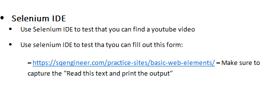
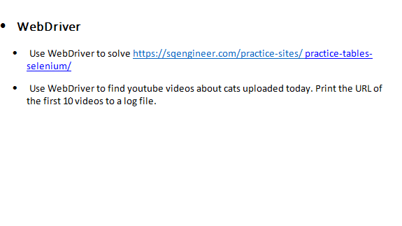
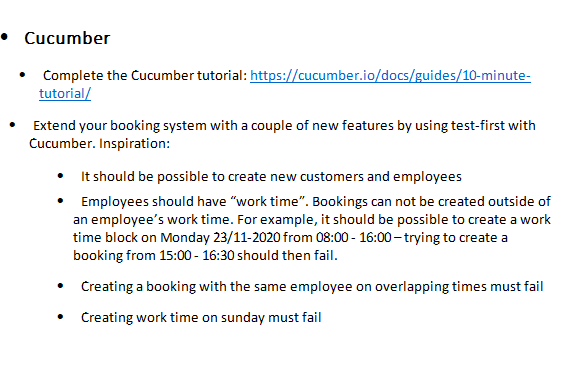

# Test Assignment 5




The solution to this part of the assignment can be found in the
````selenium_ide_projects```` folder

#### To run 
1. Make sure you have the seleniumIDE extension for you browser. 
2. Then open the ````.side```` file you want to test in the seleniumIDE.
3. Then run all the commands in the upper left corner




The solution to this part of the assignment can be found in the
````src/test/java/dk/cosby/cph/test/test_assignment_5_selenium```` folder

#### To run
1. Make sure you have the Chrome browser installed in the default 
location. If not, then you will have to initialize the webdriver 
some other way.
2. Run the Java class you want to try.




The solution to this part of the assignment can be found in the repository
````https://github.com/Cosby1992/AssignmentTestBookingSystem```` you can 
follow [this link](https://github.com/Cosby1992/AssignmentTestBookingSystem) to get there.